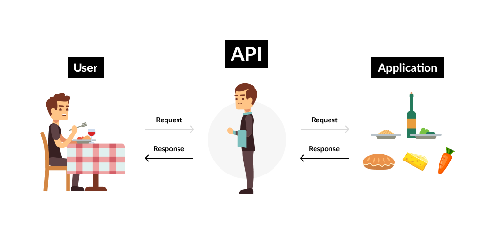

# Api-simple-explanation
## What is an API? 

An **API (Application Programming Interface)** is a set of rules and protocols that allows one software application to interact and communicate with another. Think of it as a bridge or translator that enables different programs and systems to exchange data and functionality without needing to understand each other’s internal workings.
 
## Key Points About APIs
 
### 1. Purpose  
- Allow software systems to connect and interact. 
- Enable developers to use pre-built functionality without reinventing the wheel.  
   
### 2. How It Works   
1. A client (e.g., your application or web browser) sends a **request** to a server via the API.   
2. The server processes the request and sends back a **response**, often in formats like **JSON** or **XML**.  
 
### 3. Types of APIs  
- **Web APIs**: Communicate over the internet (e.g., REST APIs, GraphQL).
- **Operating System APIs**: Allow apps to interact with the OS (e.g., Android, Windows). 
- **Library/Framework APIs**: Allow apps to use functions of a programming library (e.g., TensorFlow, NumPy).
 
### 4. Common Uses
- **Social Media**: Access data (like tweets or posts) from platforms like Twitter or Facebook. 
- **Payments**: Integrate payment services like PayPal or Stripe. 
- **Maps**: Embed maps or geolocation services using Google Maps API.
- **AI/ML Services**: Use pre-trained AI models via APIs like OpenAI or AWS AI. 

### 5. Example
If you use an app to book a flight:
1. The app interacts with the airline's API.
2. The API fetches real-time flight details, prices, and availability. 

---
 
APIs make it easier for applications to "talk" to each other and share resources, enhancing functionality and integration.
